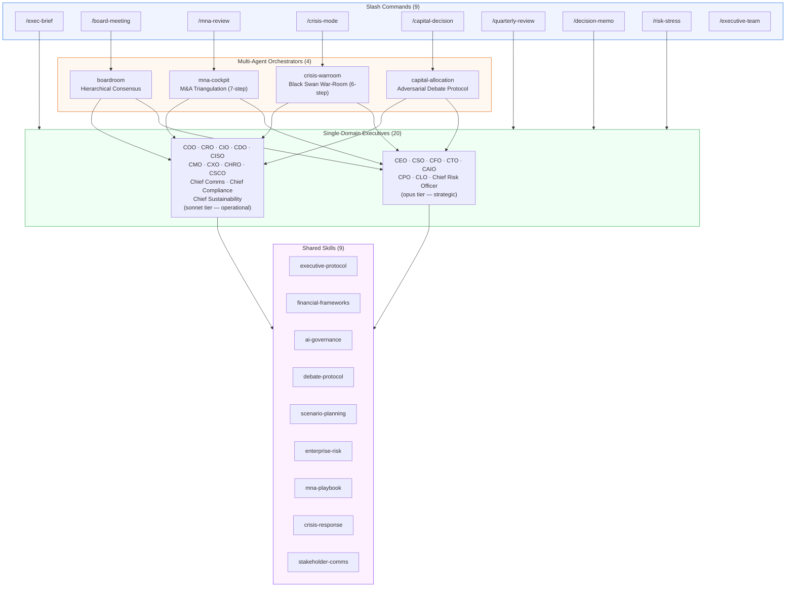
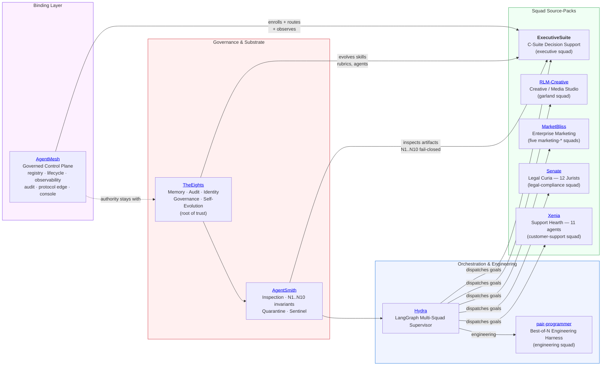
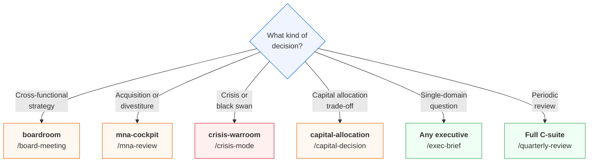
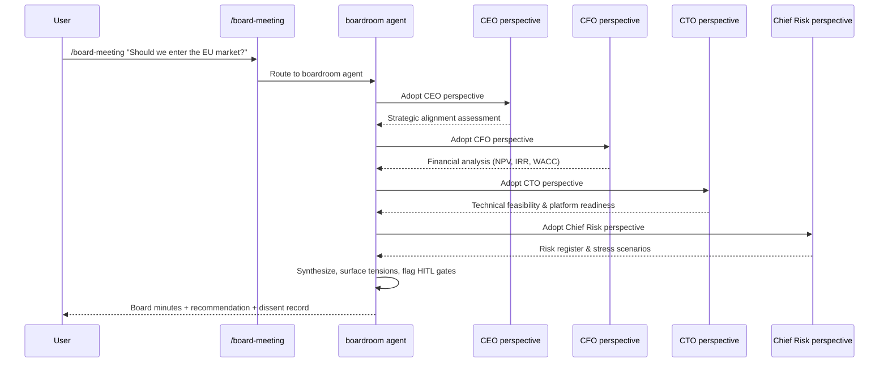

# ExecutiveSuite


A comprehensive multi-agent C-suite for [Claude Code](https://docs.anthropic.com/en/docs/claude-code): 20 single-domain executive agents, 4 multi-agent orchestrators (synthetic boardroom, M&A cockpit, crisis war-room, capital allocation committee), 9 shared skills, and 9 slash commands. Grounded in a 37,000-word research document on corporate multi-agent AI systems for strategic decision support, information triage, and financial architecture integration.

---

## Architecture



Each orchestrator **adopts executive perspectives in-process** (sequential persona adoption, not subagent spawning), synthesizing cross-functional recommendations and surfacing tensions. This avoids the multi-agent failure modes (specification ambiguity, organizational breakdown, weak verification) cataloged in the research document.

---

## Ecosystem

ExecutiveSuite is the **"executive" squad** in a mesh of nine sibling AI systems bound together by a tenth layer, **AgentMesh**. It runs standalone or as part of this larger multi-agent ecosystem. ExecutiveSuite enrolls into the mesh via the `mesh-manifest.yaml` at this repo's root.



| System | Role | Relationship to ExecutiveSuite |
|--------|------|--------------------------------|
| **[TheEights](https://github.com/lebobo88/TheEights)** | Shared memory / audit / identity / governance / self-evolution substrate; the root of trust. | Proposes and manages evolution of ExecutiveSuite's skills, rubrics, and agent definitions through a governed propose/evaluate/commit cycle. |
| **[AgentSmith](https://github.com/lebobo88/AgentSmith)** | Artifact inspection, the N1..N10 fail-closed invariants, quarantine + sentinel (the Matrix warden). | Validates ExecutiveSuite artifacts, enforces constitutional invariants, and can quarantine rogue artifacts. |
| **[Hydra](https://github.com/lebobo88/Hydra)** | LangGraph multi-squad supervisor; routes, governs, synthesizes. Hosts the squads. | Dispatches goals to ExecutiveSuite as the **executive** squad; delivers structured decision packets between squads. |
| **[pair-programmer](https://github.com/lebobo88/pair-programmer)** | Best-of-N engineering harness; Hydra's **engineering** squad. | ExecutiveSuite's taxonomy, team pipelines, and debate protocols originated here. |
| **[RLM-Creative](https://github.com/lebobo88/RLM-Creative)** | Creative / media studio; the **garland** squad. | Sibling squad; ExecutiveSuite's agent file format mirrors RLM-Creative. |
| **[MarketBliss](https://github.com/lebobo88/MarketBliss)** | Enterprise marketing platform; the five **marketing-\*** squads. | Sibling squad-pack under the same Hydra supervisor. |
| **[Senate](https://github.com/lebobo88/Senate)** | PhD-level legal wing, "the Curia" — 12 jurists under the Twelve Tables, resolving by the Law of Citations, gatekept by the Tribune's Veto (HITL); the **legal-compliance** squad. | Sibling squad; active legal/compliance counterpart to the C-suite's CLO/Chief Compliance roles. |
| **[Xenia](https://github.com/lebobo88/Xenia-Support)** | Customer-support "Hearth" — an 11-agent crew for ticket triage, recommendation, VoC, and approval-gated execution with WS-AUTH capability enforcement; the **customer-support** squad. | Sibling squad; active customer-support counterpart. |
| **[AgentMesh](https://github.com/lebobo88/AgentMesh)** | The thin, governed control plane binding all nine systems. | ExecutiveSuite enrolls via `mesh-manifest.yaml`; AgentMesh routes and observes but enforces no governance of its own. |

### AgentMesh — binding control plane

**AgentMesh** is the tenth layer: the thin, governed **control plane** that unifies the nine sibling systems behind ONE registry (SQLite `~/.agentmesh/state.db`; sole writer of `~/.hydra/backends.json`), ONE lifecycle supervisor (Win32 Job Objects + crash-loop breaker + health probes), ONE observability plane (OTEL + structured logs), ONE federated read-only audit timeline (stitched from TheEights/AgentSmith/Hydra chains), ONE external protocol edge (A2A v0.3/v1.0, REST, MCP-over-HTTP), and ONE operator web console.

ExecutiveSuite **enrolls** into the mesh by shipping the `mesh-manifest.yaml` at this repo's root. Enrollment is **fail-closed**: JSON-Schema validation against `AgentMesh/mesh-manifest.schema.json`, constitution attestation (via TheEights), and AgentSmith structural inspection must all pass. AgentMesh's manifest declares the `executive_suite` backend, the `es.ping` health probe, the nine `es.*` MCP tools, and the governance routing (constitution attestation and audit federation flow through TheEights, not AgentMesh).

AgentMesh **enforces no governance of its own** — authority stays with **TheEights → AgentSmith → Hydra** (precedence order). It routes and observes; it does not arbitrate.

---

## Quick Start

Once installed (see [Installation](#installation)), from any Claude Code session:

```
/executive-team                                # See the full roster
/exec-brief cfo Evaluate the Ohio plant expansion
/board-meeting Should we acquire CompetitorX?
/capital-decision $50M brand campaign vs. R&D investment
/mna-review Bolt-on of regional supplier
/crisis-mode red Ransomware on production ERP
/quarterly-review Q3 2026
/decision-memo Should we delay launch by 6 weeks?
/risk-stress
```

---

## Roster

### Executives (20)

| Agent | Title | Model | Key Skills |
|-------|-------|-------|------------|
| `ceo` | Chief Executive Officer | opus | executive-protocol |
| `cso` | Chief Strategy Officer | opus | executive-protocol, scenario-planning |
| `cfo` | Chief Financial Officer | opus | executive-protocol, financial-frameworks |
| `cto` | Chief Technology Officer | opus | executive-protocol |
| `caio` | Chief AI Officer | opus | executive-protocol, ai-governance |
| `cpo` | Chief Product Officer | opus | executive-protocol |
| `clo` | Chief Legal Officer / General Counsel | opus | executive-protocol |
| `chief-risk-officer` | Chief Risk Officer (Enterprise Risk) | opus | executive-protocol, enterprise-risk, scenario-planning |
| `coo` | Chief Operating Officer | sonnet | executive-protocol |
| `cro` | Chief Revenue Officer | sonnet | executive-protocol |
| `cio` | Chief Information Officer | sonnet | executive-protocol |
| `cdo` | Chief Data Officer | sonnet | executive-protocol |
| `ciso` | Chief Information Security Officer | sonnet | executive-protocol |
| `cmo` | Chief Marketing Officer | sonnet | executive-protocol |
| `cxo` | Chief Customer Experience Officer | sonnet | executive-protocol |
| `chief-communications-officer` | Chief Communications Officer | sonnet | executive-protocol, stakeholder-comms |
| `chro` | Chief Human Resources Officer | sonnet | executive-protocol |
| `chief-compliance-officer` | Chief Compliance Officer | sonnet | executive-protocol, ai-governance |
| `csco` | Chief Supply Chain Officer | sonnet | executive-protocol |
| `chief-sustainability-officer` | Chief Sustainability Officer | sonnet | executive-protocol |

### Orchestrators (4)

| Agent | Purpose | Model | Max Turns | Key Skills |
|-------|---------|-------|-----------|------------|
| `boardroom` | Synthetic boardroom facilitator — hierarchical consensus | opus | 40 | executive-protocol, debate-protocol |
| `mna-cockpit` | M&A opportunity triangulation — 7-step workflow | opus | 50 | executive-protocol, mna-playbook, financial-frameworks, debate-protocol |
| `crisis-warroom` | Black swan capital preservation — 6-step workflow | opus | 50 | executive-protocol, crisis-response, financial-frameworks, scenario-planning |
| `capital-allocation` | Capital allocation committee — CFO-led adversarial debate | opus | 30 | executive-protocol, financial-frameworks, debate-protocol |

### When to use which orchestrator



---

## Skills (9)

| Skill | Purpose | Used By |
|-------|---------|---------|
| `executive-protocol` | Memo templates, board meeting format, RACI, OKR, escalation rules, dissent format | All agents |
| `financial-frameworks` | WACC, NPV, IRR, payback, EVA, real-options, Monte Carlo, covenant/liquidity checks | CFO, mna-cockpit, capital-allocation, crisis-warroom |
| `ai-governance` | EU AI Act Article 9, NIST AI RMF, ISO/IEC 42001, model cards, HITL policy | CAIO, chief-compliance-officer |
| `debate-protocol` | Adversarial red-team debate: specification, briefs, cross-examination, adjudication | boardroom, mna-cockpit, crisis-warroom, capital-allocation |
| `scenario-planning` | 2x2 matrices, Monte Carlo setup, sensitivity/tornado, decision trees, war-games, reverse stress | CSO, chief-risk-officer, crisis-warroom |
| `enterprise-risk` | COSO ERM 2017 + ISO 31000, risk taxonomy, appetite, KRIs, Bow-Tie, three-lines-of-defense | chief-risk-officer |
| `mna-playbook` | Deal thesis, screening, financial/commercial/legal diligence, valuation, integration playbook | mna-cockpit |
| `crisis-response` | Crisis classification, triggers, escalation tiers, rapid liquidity stress, holding statements, AAR | crisis-warroom |
| `stakeholder-comms` | Mendelow map, audience-specific frameworks, board decks, investor narrative, crisis statements | chief-communications-officer |

---

## Slash Commands (9)

| Command | Usage | Routes To |
|---------|-------|-----------|
| `/exec-brief` | `/exec-brief <slug> <question>` | Single executive by slug |
| `/board-meeting` | `/board-meeting [--format brief\|strategic] <topic>` | boardroom orchestrator |
| `/mna-review` | `/mna-review <deal description>` | mna-cockpit orchestrator |
| `/crisis-mode` | `/crisis-mode <yellow\|orange\|red> <event>` | crisis-warroom orchestrator |
| `/capital-decision` | `/capital-decision <decision frame>` | capital-allocation orchestrator |
| `/quarterly-review` | `/quarterly-review Q[N] [YYYY]` | All 20 executives sequentially |
| `/decision-memo` | `/decision-memo [--exec slug\|--board] <question>` | Single exec or boardroom |
| `/risk-stress` | `/risk-stress [--scenario base\|mild\|severe]` | CFO + Chief Risk + Chief Sustainability |
| `/executive-team` | `/executive-team` | Informational roster listing |

---

## How It Works

### Subagent Architecture

Each agent is a standard Claude Code subagent — a Markdown file with YAML frontmatter (`name`, `description`, `model`, `maxTurns`, `skills`). Agents are invoked by name via the `Agent` tool or routed automatically when their `description` matches the user's task.

Skills are loaded into context when listed in an agent's `skills:` frontmatter. The `executive-protocol` skill provides the memo, board-meeting, RACI, OKR, and escalation templates that every agent uses.

### In-Process Persona Orchestration

The orchestrators (`boardroom`, `mna-cockpit`, `crisis-warroom`, `capital-allocation`) impersonate multiple executive perspectives **in-process** — sequential persona adoption per role, with synthesized output. They do **not** spawn subagents. This mitigates the multi-agent failure modes (specification ambiguity, organizational breakdown, weak verification) cataloged in the research document.



### Financial Hardcoding Directive

Per the research document, agents treat the following as **first-class deterministic tools**, not informal guidance:

- **WACC** computation (capital structure + market inputs)
- **NPV, IRR, payback, economic profit** (investment analysis)
- **Real-options valuation** (binomial lattice or Monte Carlo simulation)
- **Monte Carlo scenario engines** (probability-weighted outcomes)
- **Covenant / leverage / liquidity checkers** (hard guardrails)

Hard guardrails are enforced **before** any agent recommends action:

| Guardrail | Threshold |
|-----------|-----------|
| Minimum IRR | WACC + risk premium (0% low, 2% med, 5% high, 10%+ venture/M&A) |
| Maximum leverage | Net debt / EBITDA ≤ 3.0x (board-set) |
| Covenant headroom | ≥ 20% |
| Liquidity runway | ≥ 12 months (base), ≥ 6 months (stress) |
| Counterparty concentration | No single counterparty > 10% of receivables |
| Sanctions exposure | Zero tolerance |

---

## Governance Posture

- **Financial Hardcoding Directive** — WACC / NPV / IRR / real-options / Monte Carlo / covenant / liquidity checks as first-class tools (see `financial-frameworks` skill)
- **EU AI Act Article 9** — risk classification + lifecycle gates + audit trail (see `ai-governance` skill)
- **NIST AI RMF** — GOVERN / MAP / MEASURE / MANAGE function map
- **COSO ERM 2017 + ISO 31000** — enterprise risk framework
- **HITL gates** — every high-impact recommendation surfaces required human approvals
- **Audit trail** — every recommendation traceable to source data, exec persona, framework applied
- **Dissent preservation** — dissenting opinions recorded verbatim, never paraphrased away

---

## Output Structure

Executive artifacts are saved to `output/<domain>/<topic>-YYYY-MM-DD.md`:

```
output/
  strategy/          # ceo, cso
  finance/           # cfo, capital-allocation
  revenue/           # cro
  risk/              # chief-risk-officer
  operations/        # coo
  supply-chain/      # csco
  technology/        # cto
  it/                # cio
  data/              # cdo
  ai/                # caio
  security/          # ciso
  product/           # cpo
  marketing/         # cmo
  customer/          # cxo
  communications/    # chief-communications-officer
  people/            # chro
  legal/             # clo
  compliance/        # chief-compliance-officer
  sustainability/    # chief-sustainability-officer
  board/             # boardroom
  mna/               # mna-cockpit
  crisis/            # crisis-warroom
```

The `output/` directory is relative to the project Claude Code was launched from. Each project accumulates its own artifact tree.

---

## Installation

### Plugin scope (recommended)

Install or load ExecutiveSuite directly as a Claude Code plugin:

```bash
# Add plugin directly
claude plugin add ./plugins/executive-suite
```

### User scope (available in every project)

Install agents, skills, and commands into `~/.claude/` so they are available globally.

#### Windows — symlink (recommended for live updates)

Requires either an **elevated PowerShell** or Windows **Developer Mode** enabled (`Settings > System > For developers > Developer Mode`). Run from the cloned `ExecutiveSuite` directory:

```powershell
$src = Join-Path (Get-Location) "plugins\executive-suite"
$dst = Join-Path $env:USERPROFILE ".claude"

foreach ($d in 'agents','skills','commands') {
  if (-not (Test-Path "$dst\$d")) { New-Item -ItemType Directory -Path "$dst\$d" -Force | Out-Null }
  Get-ChildItem "$src\$d" | ForEach-Object {
    $linkPath = Join-Path "$dst\$d" $_.Name
    if (Test-Path $linkPath) { Remove-Item $linkPath -Recurse -Force }
    New-Item -ItemType SymbolicLink -Path $linkPath -Target $_.FullName | Out-Null
  }
}
```

Verify:

```powershell
$dst = Join-Path $env:USERPROFILE ".claude"
foreach ($d in 'agents','skills','commands') {
  $n = (Get-ChildItem "$dst\$d" |
        Where-Object { $_.LinkType -eq 'SymbolicLink' -and $_.Target -like '*ExecutiveSuite*' }).Count
  "$d : $n symlinks"
}
# Expected: agents : 24, skills : 9, commands : 9
```

#### Windows — copy (no Developer Mode / Admin needed)

Edits in the repo require re-running this to propagate:

```powershell
$src = Join-Path (Get-Location) "plugins\executive-suite"
$dst = Join-Path $env:USERPROFILE ".claude"

Copy-Item "$src\agents\*"   "$dst\agents\"   -Recurse -Force
Copy-Item "$src\skills\*"   "$dst\skills\"   -Recurse -Force
Copy-Item "$src\commands\*" "$dst\commands\" -Recurse -Force
```

#### macOS / Linux

```bash
src="$(pwd)/plugins/executive-suite"   # run from the cloned ExecutiveSuite directory
dst="$HOME/.claude"
for d in agents skills commands; do
  mkdir -p "$dst/$d"
  for f in "$src/$d"/*; do
    ln -snf "$f" "$dst/$d/$(basename "$f")"
  done
done
```

#### What is NOT installed globally

- `settings.json` — project-scoped (output root + status line + permissions). Do not promote to user scope.
- `CLAUDE.md` — project contract. Promoting it would inject ExecutiveSuite framing into unrelated projects.

#### Rollback (user scope)

Removes only ExecutiveSuite assets from `~/.claude/` (links or copies); leaves the source repo untouched:

```powershell
$dst = Join-Path $env:USERPROFILE ".claude"

# Symlinks: filter by target
foreach ($d in 'agents','skills','commands') {
  Get-ChildItem "$dst\$d" |
    Where-Object { $_.LinkType -eq 'SymbolicLink' -and $_.Target -like '*ExecutiveSuite*' } |
    ForEach-Object { Remove-Item $_.FullName -Force }
}

# Copies: remove by name
$execAgents = 'ceo','cso','coo','cfo','cro','chief-risk-officer','cto','cio','cdo','caio','ciso','cpo','cmo','cxo','chief-communications-officer','chro','clo','chief-compliance-officer','csco','chief-sustainability-officer','boardroom','mna-cockpit','crisis-warroom','capital-allocation'
$execAgents | ForEach-Object { Remove-Item "$dst\agents\$_.md" -ErrorAction SilentlyContinue }

$execSkills = 'executive-protocol','financial-frameworks','ai-governance','debate-protocol','scenario-planning','enterprise-risk','mna-playbook','crisis-response','stakeholder-comms'
$execSkills | ForEach-Object { Remove-Item "$dst\skills\$_" -Recurse -Force -ErrorAction SilentlyContinue }

$execCmds = 'exec-brief','board-meeting','mna-review','crisis-mode','capital-decision','quarterly-review','decision-memo','risk-stress','executive-team'
$execCmds | ForEach-Object { Remove-Item "$dst\commands\$_.md" -ErrorAction SilentlyContinue }
```

---

## Provenance

- **Research basis**: `Corporate Multi-Agent AI Systems for C-Suite Strategic Decision Support, Information Triage, and Financial Architecture Integration.md` (included in this repository)
- **Agent format**: Mirrors [RLM-Creative](https://github.com/lebobo88/RLM-Creative) (media-vertical C-suite agents, generalized here to enterprise)
- **Orchestration patterns**: Informed by [pair-programmer](https://github.com/lebobo88/pair-programmer) (taxonomy, teams, debate harness)

### Related Projects

| Project | Role | Link |
|---------|------|------|
| **TheEights** | Shared memory / audit / identity / governance / self-evolution substrate — the root of trust | [github.com/lebobo88/TheEights](https://github.com/lebobo88/TheEights) |
| **AgentSmith** | Artifact inspection, N1..N10 fail-closed invariants, quarantine + sentinel (the Matrix warden) | [github.com/lebobo88/AgentSmith](https://github.com/lebobo88/AgentSmith) |
| **Hydra** | LangGraph multi-squad supervisor — dispatches goals to ExecutiveSuite | [github.com/lebobo88/Hydra](https://github.com/lebobo88/Hydra) |
| **pair-programmer** | Best-of-N engineering harness — taxonomy, teams, best-of-N judging (engineering squad) | [github.com/lebobo88/pair-programmer](https://github.com/lebobo88/pair-programmer) |
| **RLM-Creative** | Creative / media studio — domain-specific C-suite (garland squad) | [github.com/lebobo88/RLM-Creative](https://github.com/lebobo88/RLM-Creative) |
| **MarketBliss** | Enterprise marketing platform — the five marketing-* squads | [github.com/lebobo88/MarketBliss](https://github.com/lebobo88/MarketBliss) |
| **Senate** | PhD-level legal Curia — 12 jurists under the Twelve Tables (legal-compliance squad) | [github.com/lebobo88/Senate](https://github.com/lebobo88/Senate) |
| **Xenia** | Customer-support Hearth — 11-agent crew with WS-AUTH enforcement (customer-support squad) | [github.com/lebobo88/Xenia-Support](https://github.com/lebobo88/Xenia-Support) |
| **AgentMesh** | The governed control plane binding all nine systems — registry, lifecycle, observability, audit, protocol edge | [github.com/lebobo88/AgentMesh](https://github.com/lebobo88/AgentMesh) |

---

## Extending

- **Add an industry vertical**: Clone this repo, override agent files in `.claude/agents/` for your domain. Project scope wins per Claude Code subagent precedence.
- **Add a new executive**: Drop a `<slug>.md` into `.claude/agents/` following the existing template format (YAML frontmatter + persona + responsibilities + decision framework + constraints).
- **Add a workflow**: Drop a `<name>.md` into `.claude/commands/` with a `description:` frontmatter and a body describing the steps.

---

## License

[MIT](LICENSE)
